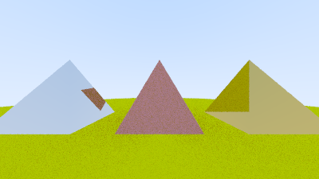

# Raytracer toy
An implementation of the [Ray Tracing in One Weekend](https://raytracing.github.io/books/RayTracingInOneWeekend.html) tutorial, but implemented in Rust rather than C++. As an added goal, the following image from the tutorial:


Was replaced with some pyramids and converted to a .png:
  


To generate a new image, run:
```
cargo run src/main.rs > img.ppm
```


